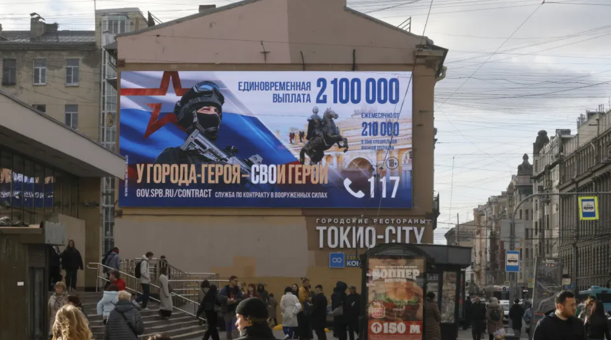
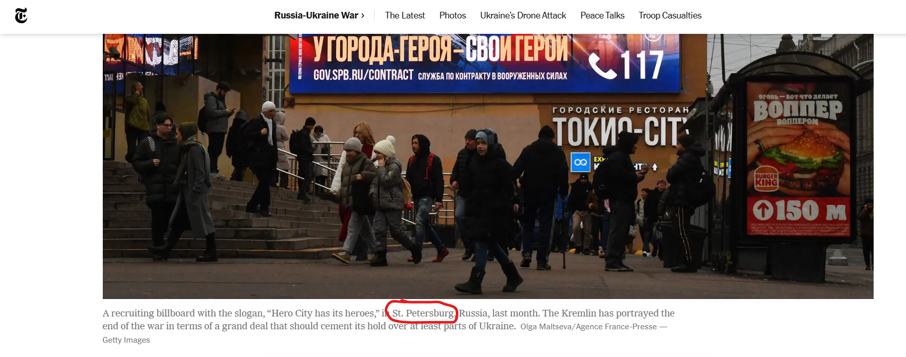
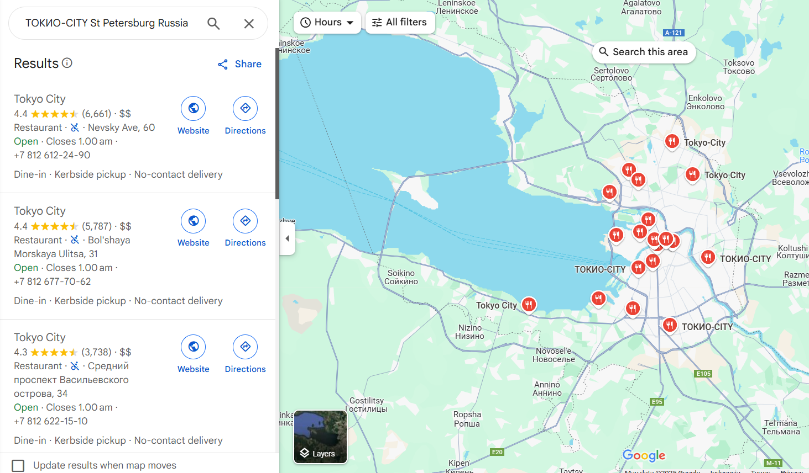
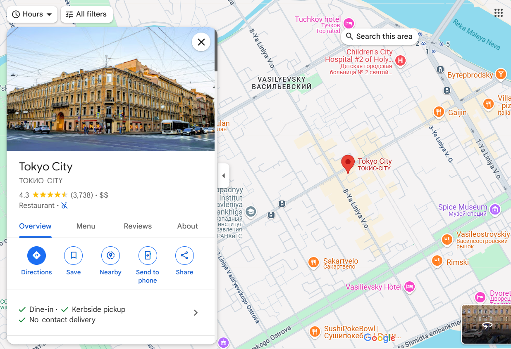
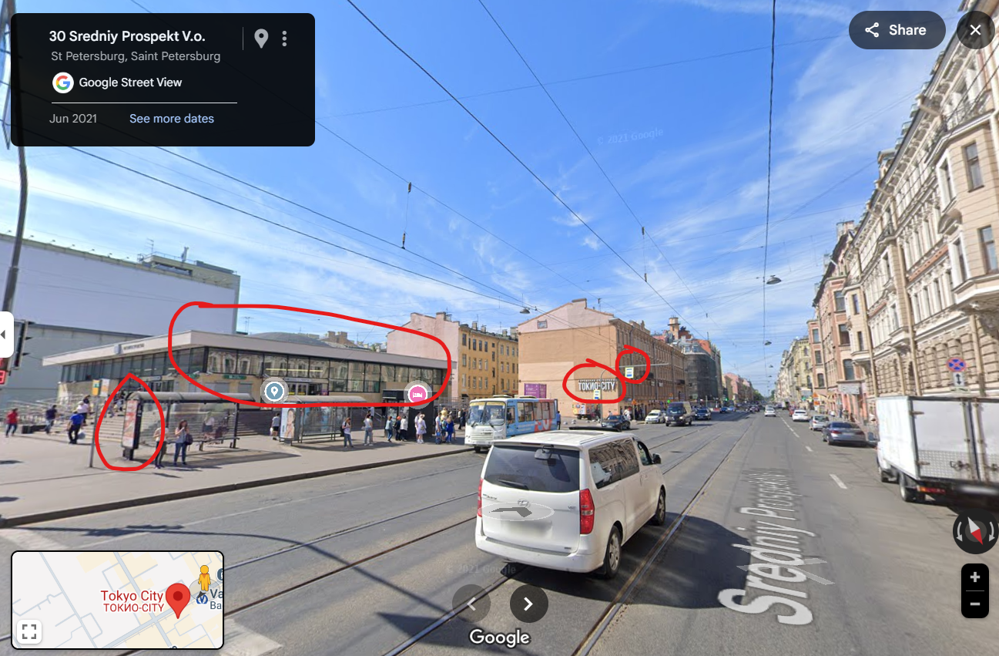
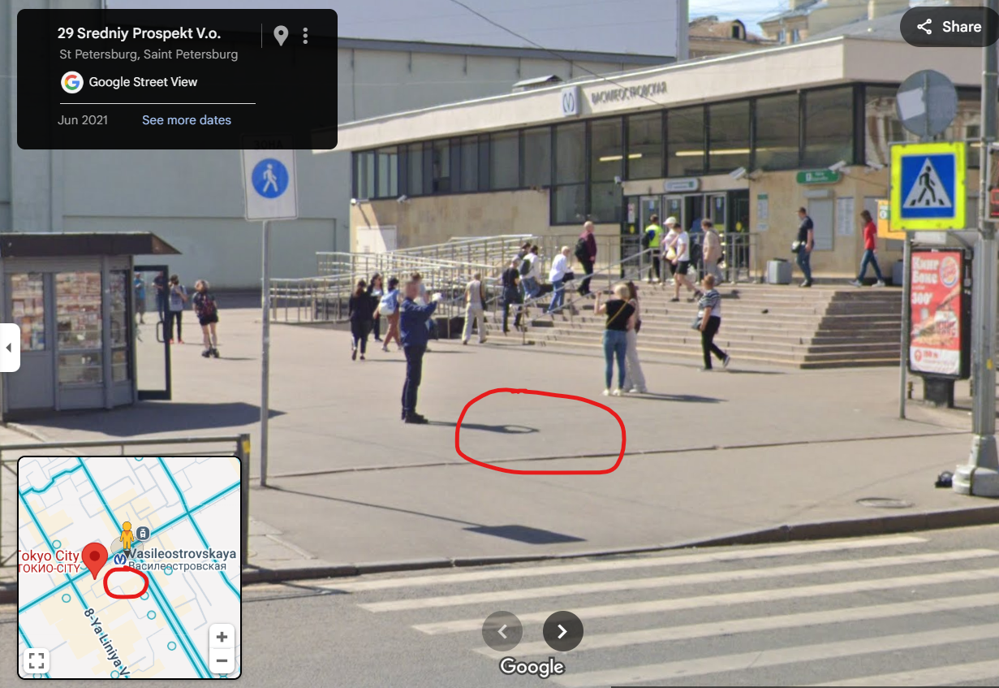

# 

## Description

記事 / Article:
https://web.archive.org/web/20250108154113/https://www.noticiasaominuto.com/mundo/2699746/kyiv-diz-que-russia-usou-como-recrutas-ate-180000-presidiarios

この記事の写真が撮影された場所はどこか。

Where were the photographs in this article taken?

## Solving Steps

### Step 1: Open the Article

---

After opening the article, we're greeted with this image. The image seems to be a Russian recruitment poster. From this initial image, we can gather some clues as to where the location could be. First, there's a sign that says
ТОКИО-CITY. Second, there's a Burger King joint 150m away from this location. Third, there's a sign on the right side that seems to be a picture of a car and has yellow borders. Since Russia is a large country, let's try to narrow down our search area.

---

### Step 2: Find the Location

---

After searching for other similar images through Google Lens, I came across another article from The New York Times. There's a hint that could lower our search area exponentially. The description under the picture says that this was in St. Petersburg.

---

After some more research, I learned that ТОКИО-CITY wasn't actually a city in Russia. Turns out it's a Japanese restaurant chain in Russia. It was quite confusing to search as ТОКИО-CITY literally translates to Tokyo City.

---

Alright, my assumption was that this location should be near a ТОКИО-CITY joint in St. Petersburg, Russia. Search this prompt on Google Maps will result in 19 locations throughout St. Petersburg. Not too bad compared to other geolocation challenges.

---

I didn't have any tricks up my sleeve to locate the exact location. Some people analyze the way the buildings are shaped, the direction, etc. In my case, I just used sheer willpower and checked each location one by one until I eventually find the correct one. One of the ТОКИО-CITY branches was this one.

---

After going into street view for this particular location, it seemed oddly familliar. After walking not too far, turns out this was the correct location. The red circles indicated the simillarities with the photo from the article. Now, all we need to do is find the exact location since there's a tolerance zone for the flag.

---

Since the photo in the original article was taken a few meters away from the Burger King advertisement, I assumed it was somewhere around the red circle. The coordinates I submitted was 59.943, 30.279.

---

### What I Learned

I learned to have patience and determination when it comes to checking each and every possible location in a geolocation challenge.
