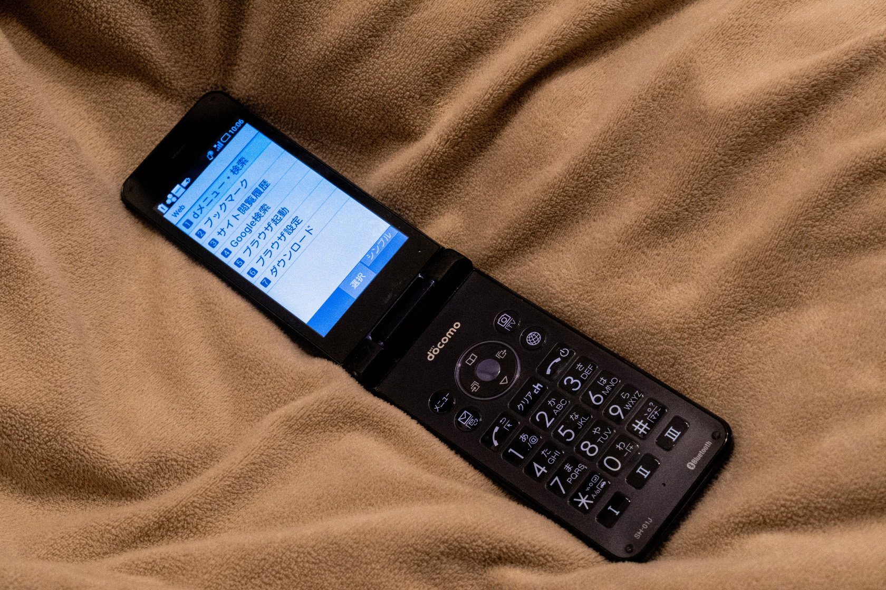
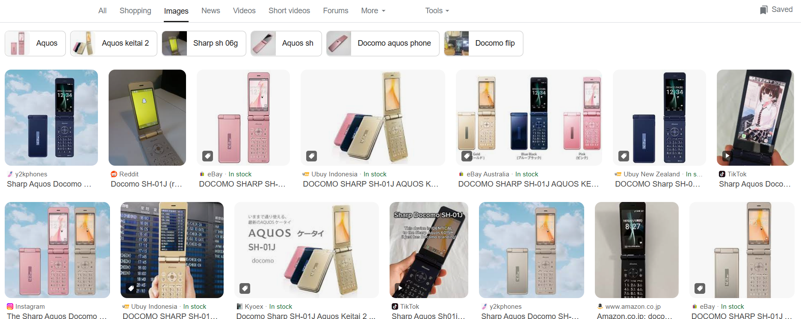
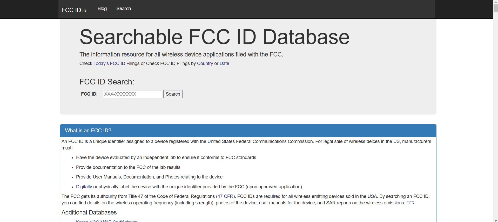
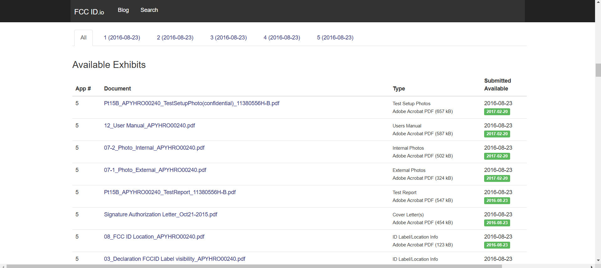
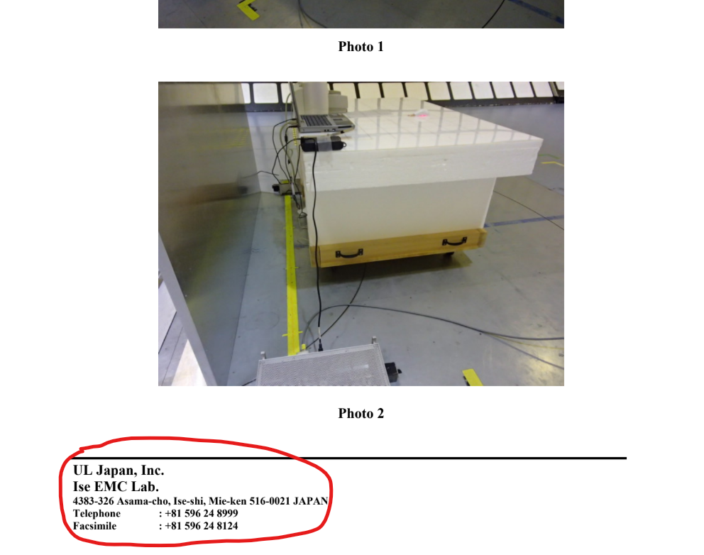
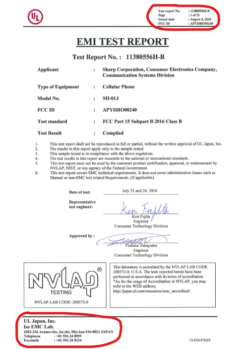
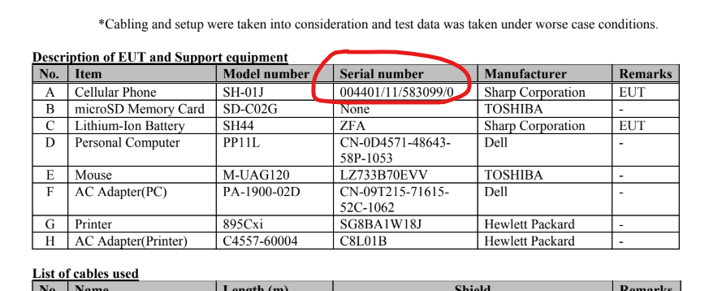

# 

## Description

2016 年 7 月 23 日～ 24 日、この携帯電話の発売に先立って EMI 試験が行われた。試験は三重県の会社が実施したようだ。その試験に供された端末のシリアル番号を答えよ。
シリアル番号に / や - といった記号を含む場合、その記号も含めて記載すること。
Flag 形式（例）: Diver25{123-45/6789-0}

An EMI test was conducted prior to the launch of this mobile phone on 23-24 July 2016. The test was conducted by a company in Mie Prefecture (Mie-ken), Japan.
Answer the serial number of the specific mobile phone that was subjected to that test.
If the serial number contains symbols such as / and -, include them.
Flag Format (example): Diver25{123-45/6789-0}

## Hint

シリアル番号は情報源に記載されている通りでよい。 / The serial number should be as listed in the information source.

## Attachments

## Solving Steps

### Step 1: Figure the Type of Phone

---

From the image given, we can see that the phone is a Docomo SH-01J. We can confirm that this is indeed the phone by searching up examples of a Docomo SH-01J along with the release date which was at 19 October 2016.

---

### Step 2: Find Information About the EMI Test

---

I honestly didn't know what to do in this challenge. So I consulted ChatGPT for some insight. It gave me a few suggestions. The first suggestion was finding the information at a Japanese MIC (Ministry of Internal Affairs and Communications) database. <a href="https://www.tele.soumu.go.jp/giteki/SearchServlet">Click here to visit the website</a>. I did a long search on every source that mentions the SH-01J but none of them seem to hold valuable information regarding the EMI test.

---

Now, the second suggestion from ChatGPT was to use FCC (Federal Communications Commission) database. <a href="https://fccid.io/">Click here to visit the website</a>. Now, in order to search for something in the FCC database, we need the product's FCC ID. After a quick Google search I found out that the ID is APYHRO00240.

---

Searching the ID up in the FCC database will lead us to a page filled with documents about the SH-01J. There are about 50 documents (some of them seems to be duplicates). I knew it was going to take a long time to search but I knew some information that could make our search area much smaller. We know that it was an EMI (Electromagnetic Interference) test was conducted on 23-24 July 2016 at Mie Prefecture. All we need to do now is parse through the documents that matches all three.

---

After searching for what seemed like hours, I finally found a document that seemed interesting. <a href="https://docs.google.com/viewerng/viewer?url=https://fccid.io/APYHRO00240/Test-Setup-Photos/Pt15B-APYHRO00240-TestSetupPhoto-confidential-11380556H-B-pdf-3109247.pdf">Click here to view the document</a>. This document is an EMC test that was held in a lab in Mie Prefecture. Although the issued date is 3 August 2016, I was sure that this was the correct document. However, this document only holds the last 3 pages of the full document which has 21 pages.

---

The name of the document was 11380556H-B so I assumed the rest of the document was also by the same name. Sure enough, it is. <a href="https://docs.google.com/viewerng/viewer?url=https://fccid.io/APYHRO00240/Test-Report/Pt15B-APYHRO00240-TestReport-11380556H-B-pdf-3109241.pdf">Click here to view the document</a>. This document has 21 pages and issued on 3 August 2016.

---

Searching instances of the word "serial" will finally show us the serial number of the phone used in the EMI test.

**`Diver25{004401/11/583099/0}`**

---

### What I Learned

I learned how to see information about tests conducted towards phone devices before their release. Which is by using the FCC database. This challenge was probably the toughest challenge that I solved in Diver 2025. Even though I had a hard time, it was quite satisfying when I finally found the correct flag.
