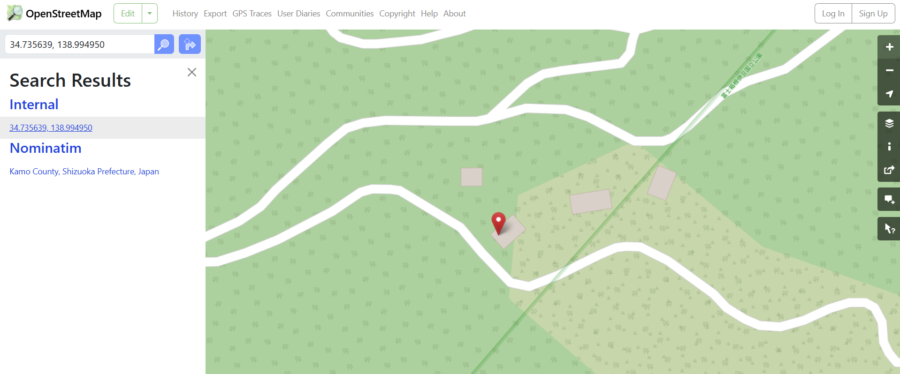

# 

## Description

34.735639, 138.994950 にある 建造物 の、OpenStreetMap における Way（ウェイ）番号を答えよ。
Flag 形式: Diver25{123456789}

Answer the Way number in OpenStreetMap of the building located at 34.735639, 138.994950. Flag Format: Diver25{123456789}

## Hint

「建造物」は「地物」の一種である / a "building" is categorized into "features"

## Solving Steps

### Step 1: Search the Coordinates in OpenStreetMap

---

First, open OpenStreetMap and search for the coordingates in the description. After zooming to the exact location, we'll end up with a house on a hillside.

---

### Step 2: Find the Way Number

---

Not too sure what a way number is in OpenStreetMap but I assumed it was an ID or tag of some sort. After searching, turns out there's a button to find the ID/tag of something in OpenStreetMap. To do this, we use the Query Features button. Which is the bottom most button on the right side of the screen (mouse cursor with a question mark icon).

---

All we need to do now is click on the building after click the Query Features button. This will show you all the tags of nearby features (features means structures in OpenStreetMap, such as buildings, streets, etc). There are two notable features that are nearby. A Scrub (whatever that is) and a building. The tag of the building is the final flag.

**`Diver25{568613762}`**

---

### What I Learned

I learned how to navigate OpenStreetMap as it was my first time using the website. I usually use Google Maps.
