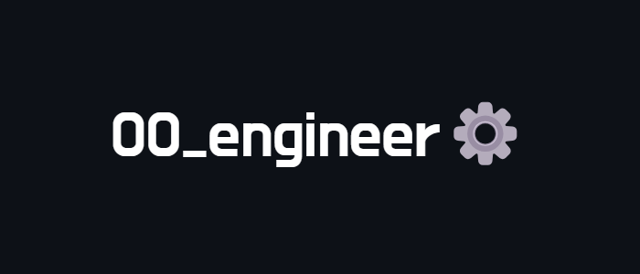
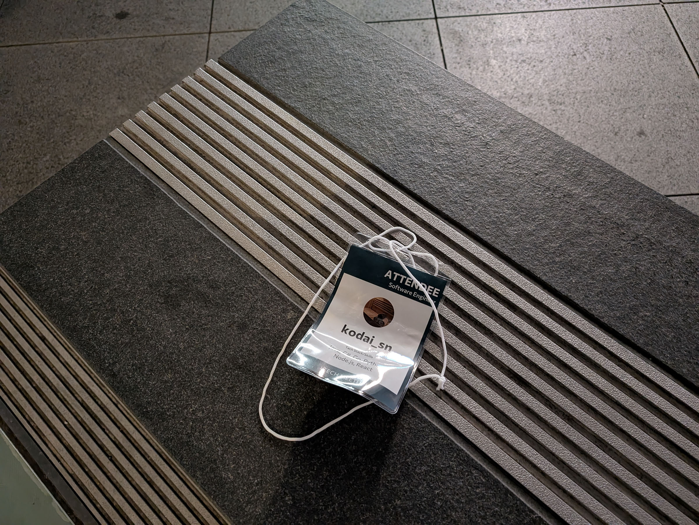
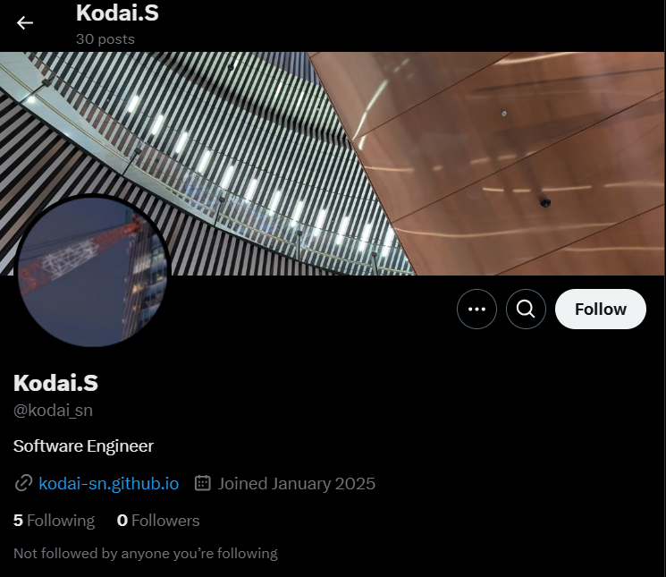
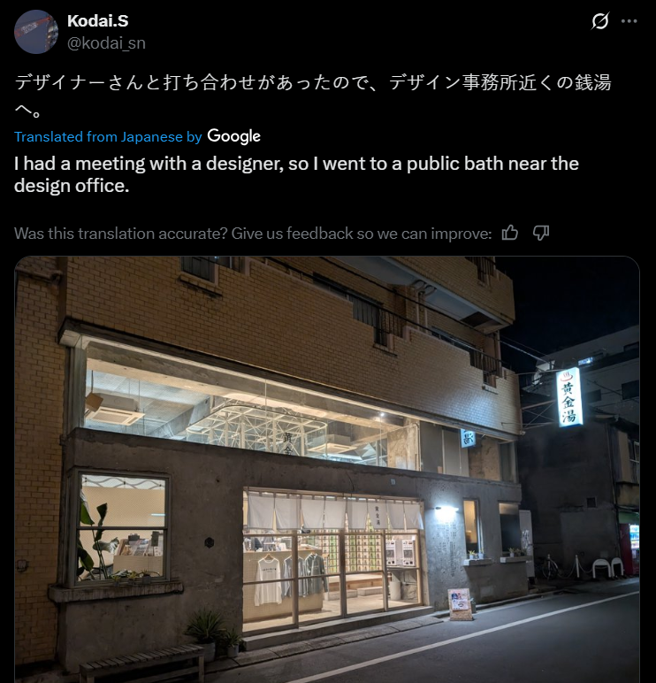
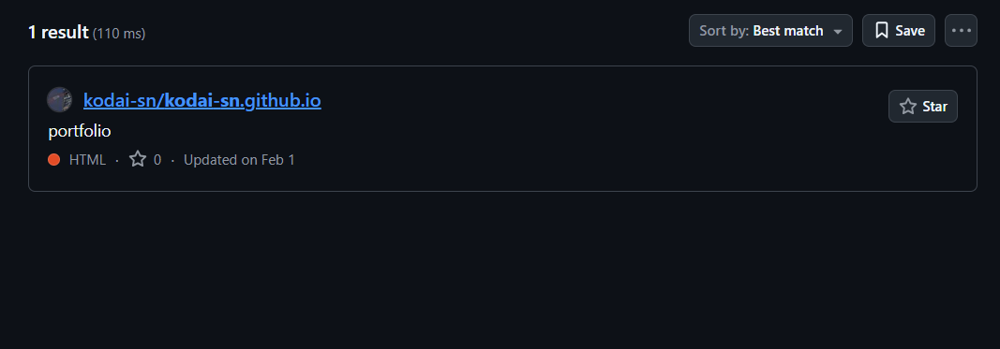
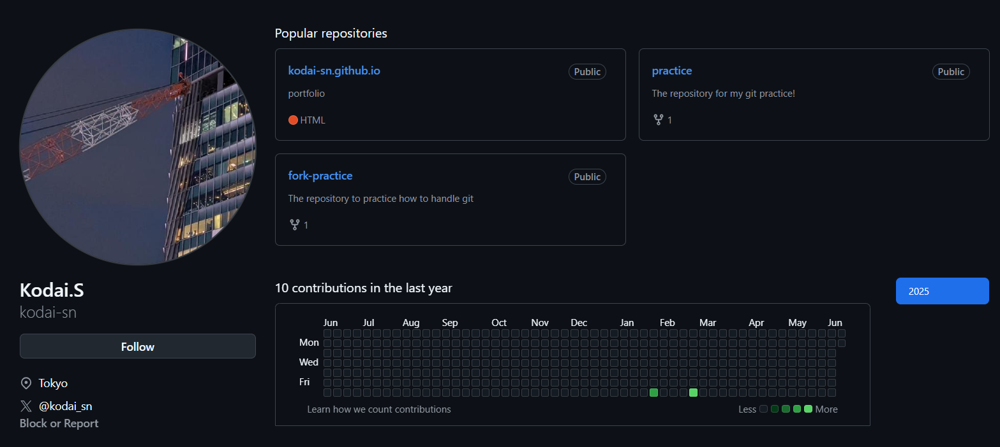
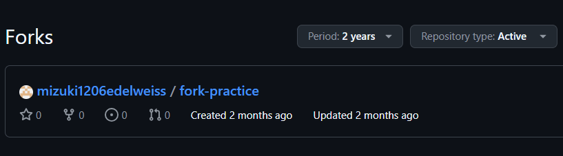
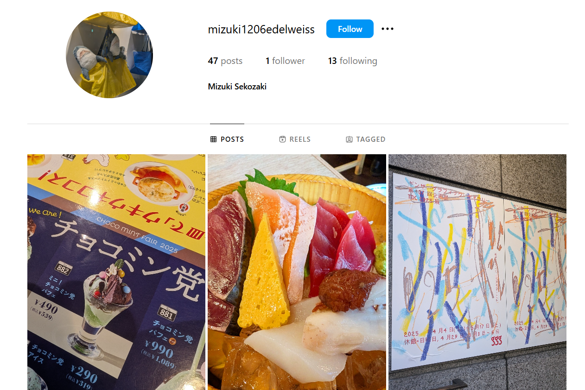
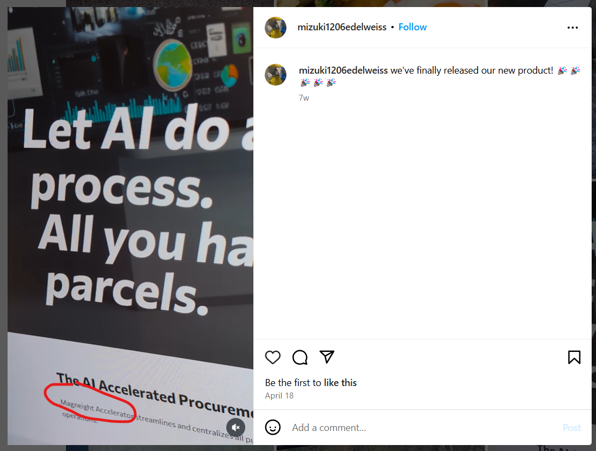

# 

## Description

東京駅の近くでソフトウェアエンジニアの名札を拾った。おそらく落とし物だろう。
このエンジニアが勤務している会社の Web サイト（トップページ）の URL を答えよ。
Flag 形式: Diver25{https://google.com}

An software engineer's nameplate was picked up near Tokyo Station. This should be a lost item.
Answer the URL of the website (index page) of the company where this engineer works.
Flag Format: Diver25{https://google.com}

recon カテゴリの問題を解答するには、この問題の情報が必要となる。ただし、この問題を除き、どの順序で解答しても構わない。
To answer the challenges in the recon category, information on this challenge is required. However, the challenges can be answered in any order except this one.

## Hint

この名札が東京駅近くで見つかったことから、日本の会社だろう。 / This should be Japanese company because this nameplate was found nearby Tokyo Station, Tokyo, Japan.

## Attachments

## Solving Steps

### Step 1: Find the Person Online

---

The picture on the attachment gave us two useful informations on how to find this person online. First, this person is a software engineer. Second, we have what seems to be his username. Whenever you're given a username in an OSINT challenge, always use Sherlock to search for any instances of that username online. Upon using Sherlock, we get that Kodai has a Twitter (X) account.

## 

### Step 2: Find Clues about the Website

---

After reading through every single post that Kodai posted, there seems to be nothing useful. At first I thought that the post above gives us the whereabouts of the the company, but after searching there doesn't seem to be any office near the onsen that's related to software engineering.

---

It seems that Kodai has a github account judging by a link to his portfolio that's on the bio of his Twitter profile. After searching for his username, kodai_sn, on Github, we got the same repository for his portfolio previously.

---

Going to Kodai's GitHub profile, we'll see three different repositories. One of the repositories, which is the fork-practice, has been forked by another person (ignore the fork at the practice repository, it wasn't there when I first solve the challenge).

---

Seems like the person who forked this repository has the username "mizuki1206edelweiss". I used Sherlock to search for this username but there weren't any userful results. One tip I've learned while doing OSINT challenges is that if you don't find anything useful on Sherlock, you must directly check Instagram.

---

Turns out the username does exist on Instagram and it leads us to this profile. I had a good feeling that clues to the website must be hidden here somewhere. Mizuki has 47 posts so I had to analyze them one by one in order to find something.

---

Lucky for me, I didn't have to search for long as there's a video of Mizuki showing what the website looks like. I'm sure this was the website because of the caption that mentions the company releasing their new product (which Kodai talked about on his Twitter). Seems like the name of their product is Magneight Accelerator. Lets do a quick Google search shall we.

### Step 3: Find the Website

---

Searching up Magneight Accelerator on Google will lead you to this website as the first result. Bingo! It's the same website in the video from Mizuki's Instagram. We've found our flag!

**`Diver25{https://magneight.com/}`**

### What I Learned

I learned how to analyze content in a person's social media for information that could prove useful. I also learned how to find a person's alternative accounts across different platforms.
