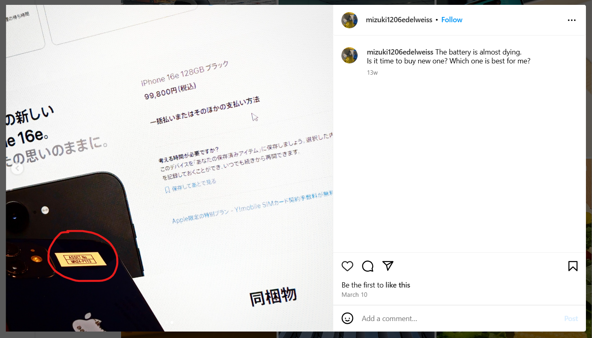

# 

## Description

"00_engineer" の問題で見つかった会社の CEO が持っていたスマートフォンの資産番号を答えよ。
Flag 形式: Diver25{ABCD-12345}

Answer the asset number of the smartphone owned by the CEO of the company found in the "00_engineer" challenge.
Flag Format: Diver25{ABCD-12345}

## Solving Steps

I noticed earlier when I was analyzing each post in Mizuki's Instagram account that she mentioned about buying a new phone. There are a total of 4 posts where Mizuki mentions phones.

One of the posts have two slides. The second slide shows the asset number of what I assume was her old Iphone since she mentioned on a later post that she'll be buying a Google Pixel. Turns out this is the correct flag.

**`Diver25{MN24-P113}`**

---

### What I Learned

I learned to always check each an every post when doing OSINT. Who knows what information a post might hold accidentally.
