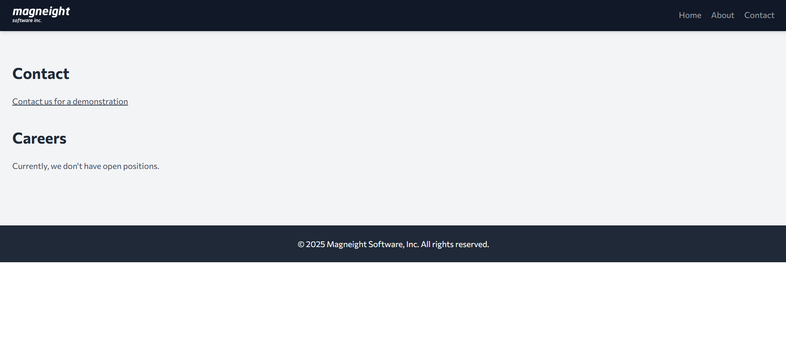
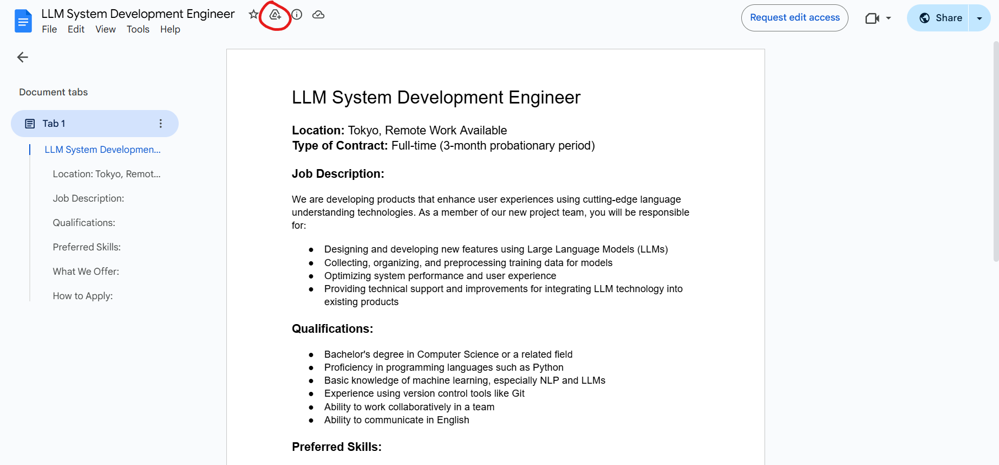
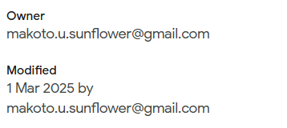
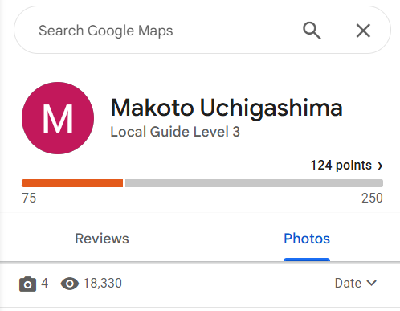

# 

## Description

"00_engineer" の問題で見つかった会社で、採用を担当していると思われる人物の氏名を答えよ。
Flag 形式: Diver25{Shigeru Ishiba} (ローマ字表記)

Answer the name of the person you think is in charge of recruitment at the company found in the "00_engineer" challenge.
Flag Format: Diver25{Shigeru Ishiba} (In Latin alphabet. NOT Hiragana, Katakana, Kanji etc.)

## Solving Steps

### Step 1: Revisiting the Website

---

The Magneight website we found earlier also has a contact page. On the contact page there's a section for recruitment which isn't open as the company wasn't taking any new recruits. So this means that they have opened it before. Which means it's time for the Wayback Machine.

### Step 2: Find Previous Versions of the Website

---

Wayback Machine didn't return any results which means this website hasn't been documented on their page. However, there's still one more website I know of that can save previous snapshots of a website. Which is archive.today (I have a mental note on this website from a CTF I participated in).

---

Surely enough, there are snapshots of the website from April 2025. The contact page now has another link that we can press on. Pressing this link will lead us to a Google Document about information regarding the recruitment.

---

The Google Document must contain information about the person in charge of recruitment within the Magneight Company. But for some reason I couldn't look at who made the document directly. Luckily, there's an easy way to counter this. You need to add a shortcut of this Google Document to your Google Drive then you can see who owns it.

### Step 3: Find the Name of the Recruiter

Then, you would want to go to your Google Drive and see the file information. The information about the email address of who made this file will be shown. But this isn't their real name. So, how do we obtain their full name? I had the bright idea to find her Google Maps account because Google Maps always shows people's full names.

---

To find a person's Google Maps account, you can't just go into Google Maps and search for their name (as far as I know). So, I used EPIEOS to help me find the recruiter's Google Maps account. EPIEOS is an OSINT search engine that allows you to perform an email or a phone reverse lookup, find related google reviews, and many other things.

---

The reverse look up EPIEOS did will give us a link to the recruiter's Google Maps account. We get that her name is Makoto Uchigashima.

**`Diver25{Makoto Uchigashima}`**

---

### What I Learned

I learned to always check if there are snapshots of previous versions of a website along with utilizing the EPIEOS tool to conduct OSINT.
